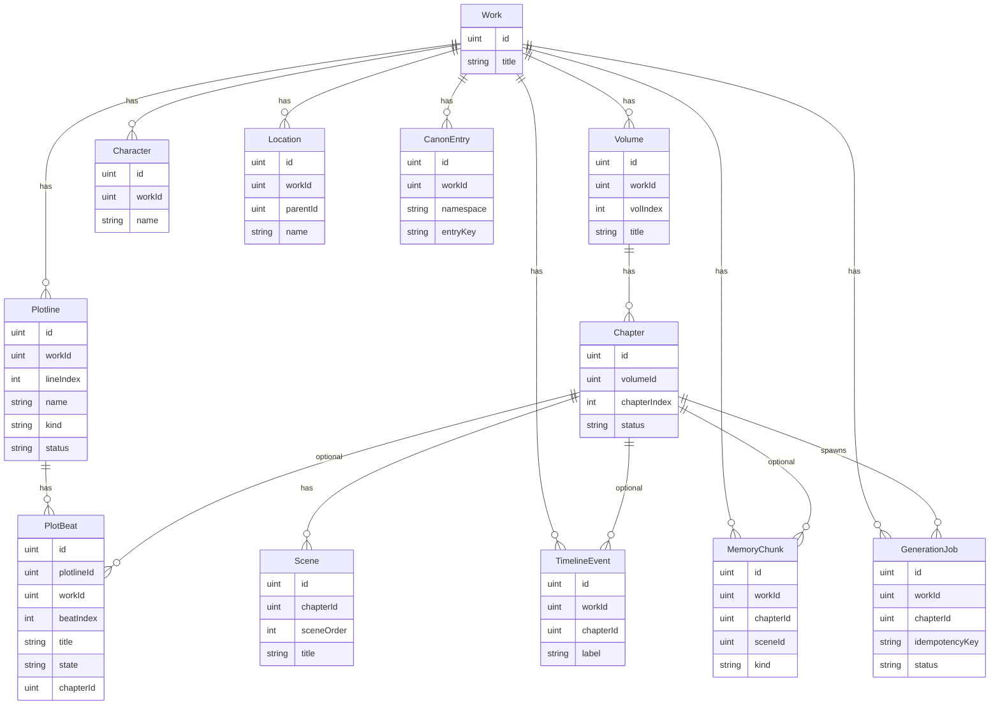

# 数据模型关系说明

本文描述 `internal/models` 下各 GORM 实体之间的 **逻辑外键关系** 与唯一约束。物理上 `lingoroutine` 的迁移默认可在迁移阶段关闭外键强校验（`DisableForeignKeyConstraintWhenMigrating`），因此 **应用层** 应保证引用完整性。

Mermaid `erDiagram` 的实体属性区 **每行只能是「类型 + 空格 + 字段名」两个记号**，不能写 `PK` / `FK_optional` / 第三段中文别名，否则会触发解析错误。

## 总览图

**说明**：图中部分列为概念示意（如可选外键在库里为指针类型，图中仍以 `uint` 表示占位）。`Location.parentId` 自引用一棵树，图中不画自环以免渲染器兼容问题。

## 故事线与 AI 编写（已落库）

库表已包含 **`Plotline`（情节线）** 与 **`PlotBeat`（节拍）**，与 `Volume` / `Chapter` 正交：前者管 **「要写哪条线、推进到哪一拍」**，后者管 **「卷章正文结构」**。引擎生成某章时建议流程：

1. 按 `WorkID` 取出 `Status=active` 的 `Plotline`，再取各线 `State` 为 `planned` / `in_progress` 的 `PlotBeat`（按 `BeatIndex` 排序）。
2. 将选中节拍的 `Title`、`Summary`、`Notes` 与 `CanonEntry` / `MemoryChunk` 检索结果一并写入系统 Prompt 或 tool 上下文。
3. 章节定稿后：把本章落实的节拍 `ChapterID` 置为当前章，`State` 更新为 `done`（或保持 `in_progress` 若跨章同一拍）。

**伏笔**仍建议用 `MemoryKindForeshadow` + `CanonEntry` 组合；节拍表负责 **结构目标**，记忆块负责 **事实与线索**。

更完整的创作管线见 [long-novel-engine.md](./long-novel-engine.md)（分层摘要、检索、校验）。

### 接下来可做的工程项（按需）

| 项 | 说明 |
|----|------|
| **API** | `POST/PATCH /works/:id/plotlines`、`/plotbeats`，以及「列出某章关联节拍」。 |
| **引擎** | `GenerationJob` 元数据里记录目标 `PlotBeat` ID 列表，便于重试与审计。 |
| **约束** | 业务层校验 `PlotBeat.WorkID` 与 `Plotline.WorkID` 一致，避免错挂。 |

## `MemoryKind` 是干什么的？

`MemoryChunk.Kind` 使用枚举 `MemoryKind`，用于标记 **这块记忆在语义上属于哪一类**，主要目的有三点：

1. **生成时检索加权**：写打斗时可降低 `style_note` 权重、提高 `fact`；回收伏笔时提高 `foreshadow`。避免「文风说明」挤占真正剧情事实的上下文窗口。
2. **与编辑器 / 校验分工**：`CanonEntry` 管硬设定；`MemoryChunk` 管从正文 **抽取** 的可变事实。`relationship` 强调人物关系变化，便于人物一致性检查。
3. **埋点与统计**：按 `Kind` 聚合可观察模型是否总在产生某类记忆而缺少另一类。

各取值含义简要对照：

| 常量 | 含义 |
|------|------|
| `MemoryKindFact` | 客观剧情事实（谁做了什么事）。 |
| `MemoryKindRelationship` | 人物关系变化（师徒反目、结盟等）。 |
| `MemoryKindForeshadow` | 伏笔与应回收的线索。 |
| `MemoryKindStyle` | 文风与叙事习惯备忘（篇幅、人称、禁用词等）。 |

实现上它们都是 **字符串枚举**（存库即为对应英文小写片段），便于日志与跨版本兼容。

## 层级与归属

| 实体 | 归属键 | 说明 |
|------|--------|------|
| `Volume` | `WorkID` → `Work` | 一部作品分多卷；同一 `WorkID` 下 `Index` 唯一。 |
| `Chapter` | `VolumeID` → `Volume` | 一卷多章；同一 `VolumeID` 下 `Index` 唯一。 |
| `Scene` | `ChapterID` → `Chapter` | 一章可多场景/片段；同一 `ChapterID` 下 `Order` 唯一。 |

## 作品维度（跨卷）

以下实体均带 `WorkID`，表示 **整部作品的设定或数据**，不随单卷变化而迁移主键。

| 实体 | 关键字段 | 与章节关系 |
|------|-----------|------------|
| `Character` | `WorkID` | 无直接 `ChapterID`；与章节的关联可在业务层用中间表或 `MemoryChunk.EntityRefs` 表达。 |
| `Location` | `WorkID`, `ParentID?` | 地点树：`ParentID` 指向同表另一条 `Location`（可选）。 |
| `TimelineEvent` | `WorkID`, `ChapterID?` | 时间线事件可只挂作品，或再关联到某一章。 |
| `CanonEntry` | `WorkID`, `Namespace`, `Key` | 硬设定；版本化字段 `Version` 由业务递增。 |
| `MemoryChunk` | `WorkID`, `ChapterID?`, `SceneID?` | 记忆块可精确定位到章/场景，便于检索与溯源。 |
| `GenerationJob` | `WorkID`, `ChapterID?` | 异步任务多针对某章生成；`IdempotencyKey` 全局唯一。 |
| `Plotline` | `WorkID` | 一条叙事线；同一作品下 `Index` 唯一，用于排序展示。 |
| `PlotBeat` | `PlotlineID`, `WorkID`（冗余） | 线上节拍；`WorkID` 便于不按线 join 的作品级查询；`ChapterID?` 表示落实到哪一章。 |

## 唯一约束（与代码中 GORM 标签一致）

- **卷**：`(`WorkID`, `Index`)` 唯一，索引名 `uidx_volume_work_idx`。
- **章**：`(`VolumeID`, `Index`)` 唯一，索引名 `uidx_chapter_volume_idx`。
- **场景**：`(`ChapterID`, `Order`)` 唯一，索引名 `uidx_scene_chapter_order`。
- **情节线**：`(`WorkID`, `Index`)` 唯一，索引名 `uidx_plotline_work_idx`。
- **节拍**：`(`PlotlineID`, `BeatIndex`)` 唯一，索引名 `uidx_plotbeat_line_order`。
- **任务**：`IdempotencyKey` 唯一（空字符串应避免作为有效键）。

## 软删除与主键

所有上述模型内嵌 `gorm.Model`，包含数值主键 `ID`、`CreatedAt`、`UpdatedAt` 及 **`DeletedAt` 软删**。关联查询时需注意默认作用域会排除已软删行。

## 与配置的对应关系

数据库连接由 `pkg/config` 的 `Database.Driver` / `Database.DSN` 提供，经 `cmd/server` 传入 `lingoroutine/bootstrap` 完成迁移；本文模型列表与 `internal/models/register.go` 中 `All()` 保持一致。
