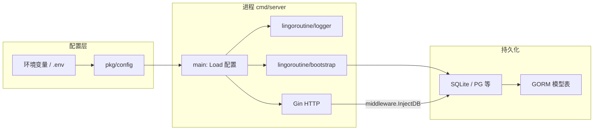
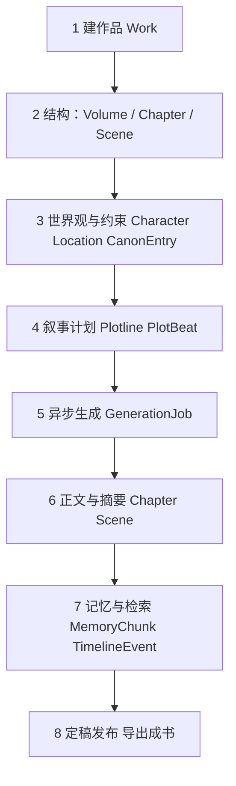
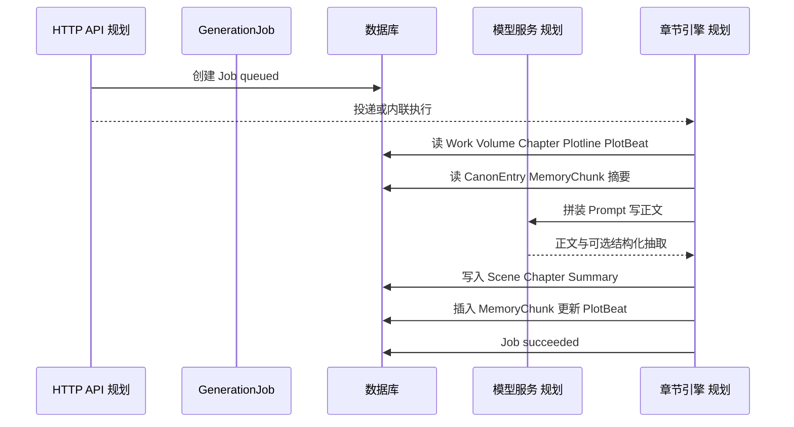

# 系统运作与数据流：从配置到成书

本文说明 **CinyuVerse 后端如何运转**，以及 **数据如何在各实体之间流动**，最终串联成可交付的 **长篇小说正文**。实现上允许分阶段落地：下文标「当前」的指仓库里已有代码或表结构；标「规划」的指引擎与 API 尚未写完但建议按此串联。

---

## 1. 文档目的与「最终小说」定义

- **目的**：给产品、前后端与引擎开发同一套 **心智模型**，知道每一步读谁、写谁、如何衔接。
- **最终小说**：在数据层体现为同一 `Work` 下已发布（或已定稿）的 **`Volume` → `Chapter` → `Scene`** 树状正文，外加可选导出物（Markdown / EPUB 等由应用层拼装）。**不是**单次模型长输出，而是 **多章持久化结果的集合**。

---

## 2. 当前运行时边界（仓库现状）

- **`pkg/config`**：启动时 `Load()` 读环境，得到 `Database`、`Server`、`Log`、`Services.LLM` 等（见 [golang-architecture.md](./golang-architecture.md)）。
- **`bootstrap.SetupDatabase`**：建连、可选执行 `migrations/*.sql`、对 `internal/models.All()` **AutoMigrate**。
- **HTTP**：当前仅有健康检查；业务 API 与异步 Worker 为 **规划**，但数据流设计已按下列章节预留位置。

---

## 3. 宏观阶段：从建作品到可读书稿

下列阶段按时间顺序排列；每一阶段主要 **写入** 的实体在括号中注明。

| 阶段 | 做什么 | 数据写入 / 更新 |
|------|--------|------------------|
| 1 | 创建作品元数据 | `Work` |
| 2 | 建卷、章、空场景骨架 | `Volume`、`Chapter`、`Scene`（可先占位） |
| 3 | 角色、地点、硬设定 | `Character`、`Location`、`CanonEntry` |
| 4 | 规划主线/支线及节拍 | `Plotline`、`PlotBeat`（`State` 多为 `planned`） |
| 5 | 提交「写第 N 章」类任务 | `GenerationJob`（`queued` → `running` → `succeeded`/`failed`） |
| 6 | 模型产出进入草稿 | `Chapter`/`Scene` 正文、`Summary`；`Chapter.Status` 如 `draft` |
| 7 | 抽取事实、伏笔、时间线 | `MemoryChunk`、`TimelineEvent`；可回写 `PlotBeat.ChapterID`、`State` |
| 8 | 审核、发布、导出 | `Chapter.Status` → `published`；导出物无单独表亦可 |

**串联关系**：`Work` 是所有跨卷数据的根；**正文层级**只挂在 `Volume`/`Chapter`/`Scene`；**编剧结构**挂在 `Plotline`/`PlotBeat`；**生成与审计**挂在 `GenerationJob`；**长期记忆与一致性**挂在 `MemoryChunk` / `CanonEntry` / `TimelineEvent`。详见 [model-relations.md](./model-relations.md)。

---

## 4. 微观数据流：生成一章（规划中的引擎步骤）

一次「写一章」在逻辑上应拆成可重试的子步骤；数据在表之间的流动如下（与 [long-novel-engine.md](./long-novel-engine.md) 中流水线一致）。

**读路径（上下文拼装）**：

1. 当前 `Chapter` 及上一章 `Summary`（或滑动窗口摘要）。
2. 本书 `Work` 梗概、当前卷 `Volume.Summary`（若有）。
3. `Plotline` / `PlotBeat`：`State` 为待推进的节拍，`Notes` 作为写作约束。
4. `CanonEntry`：硬设定，不可与正文矛盾。
5. `MemoryChunk`：按检索条件（实体、类型 `MemoryKind`）拉取，用于长书防遗忘。

**写路径（持久化顺序建议）**：

1. 在同一事务或带幂等键的流程中：更新 `Scene`/`Chapter` 正文与 `Chapter.Summary`。
2. 插入新 `MemoryChunk`；必要时追加 `TimelineEvent`。
3. 更新相关 `PlotBeat.State` 与 `ChapterID`。
4. 将 `GenerationJob` 置为 `succeeded` 并记录 `ResultChapterID`（字段已存在于模型中）。

失败时：`Job` 记 `failed` 与 `ErrorMessage`，**不**半更新正文；重试依赖 `IdempotencyKey`。

---

## 5. 如何「串」成最终小说

1. **结构顺序**：按 `Volume.Index` → `Chapter.Index` → `Scene.Order` 全表扫描，得到线性阅读顺序。
2. **内容拼接**：将各 `Scene.Content`（或章内单一大字段，若未来合并）按顺序拼接为卷文本，再拼卷为全书。
3. **状态过滤**：导出成书时仅包含 `Chapter.Status = published`（或你们定义的定稿态），避免草稿进入交付物。
4. **外置资源**：若插图、附件走对象存储，正文中可留占位符，导出时由 `Services` 配置中的存储客户端解析（配置项已在 `pkg/config` 的 LLM 侧预留扩展位，存储可按需再加）。

**与 AI 的串联**：AI 不直接「生成整书」，而是 **反复执行「一章一节拍」的循环**；每次循环依赖上一步写入的 **摘要 + 记忆 + 节拍 + Canon**，从而在长跨度上保持连贯。循环次数 = 章节数，累积结果即 **最终小说**。

---

## 6. 人机协同在数据流中的位置

- **锁段 / 改稿**：人类直接改 `Scene.Content` 后，应触发 **增量摘要** 或 **记忆重抽**（规划任务类型可挂在 `GenerationJob.Type`）。
- **吃书 / 改设定**：改 `CanonEntry` 并升 `Version`，下游章节可打「需复核」标记（业务字段或状态机，可后续加）。
- **从某一章重生**：新 `GenerationJob` 指向该章；若策略为级联失效，可批量将后续 `Chapter.Status` 标为 `stale`（需扩展枚举时再加）。

---

## 7. 相关文档索引

| 文档 | 与本篇关系 |
|------|------------|
| [long-novel-engine.md](./long-novel-engine.md) | 引擎子步骤、分层记忆、检索与校验的细化。 |
| [model-relations.md](./model-relations.md) | 表级关系与唯一约束。 |
| [golang-architecture.md](./golang-architecture.md) | `cmd/`、`internal/` 分包与 API、队列演进。 |
| [production-workflow.md](./production-workflow.md) | 项目阶段与里程碑，与工程落地节奏对齐。 |

---

## 8. 小结

- **运作**：配置 → 日志 → 数据库迁移 → HTTP（当前最小）→ **未来** API / Worker 驱动引擎。
- **数据流**：`Work` 定根 → 卷章场景承载正文 → Plotline/Beat 承载「要写什么」→ Job 驱动 LLM 写回 → Memory/Canon/Timeline 固话事实 → 定稿后按序拼接即 **最终小说**。

按此文档实现 API 与引擎时，建议为每个 `GenerationJob` 打 **结构化日志**（`work_id`、`chapter_id`、`job_id`），便于对照本数据流排查断点。
